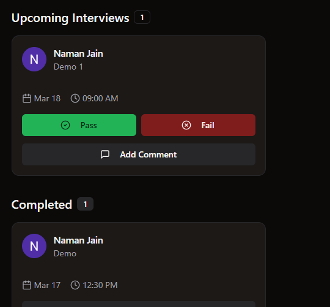

- End Call Button debugging (EndCall COmponent and Meeting room)
- Code Editor Run Simultor comparing answers with outputs (Code Insight)
- Coding Questions API (constants)
- Pass/Fail in COmment Dialog above the comment by its own updation (working well when changed by database from upcoming to completed)  (Meeting Card Component)

completed and upcoming status update nhi ho rha database mai woh sirf upcoming hi aa rha hai db mia change krne pr woh theek ho jaa rha hai
- to get Succedded and Passed sectinos in dashboard of selected candidates and failed ones (admin/Dashboard/page.tsx Component)